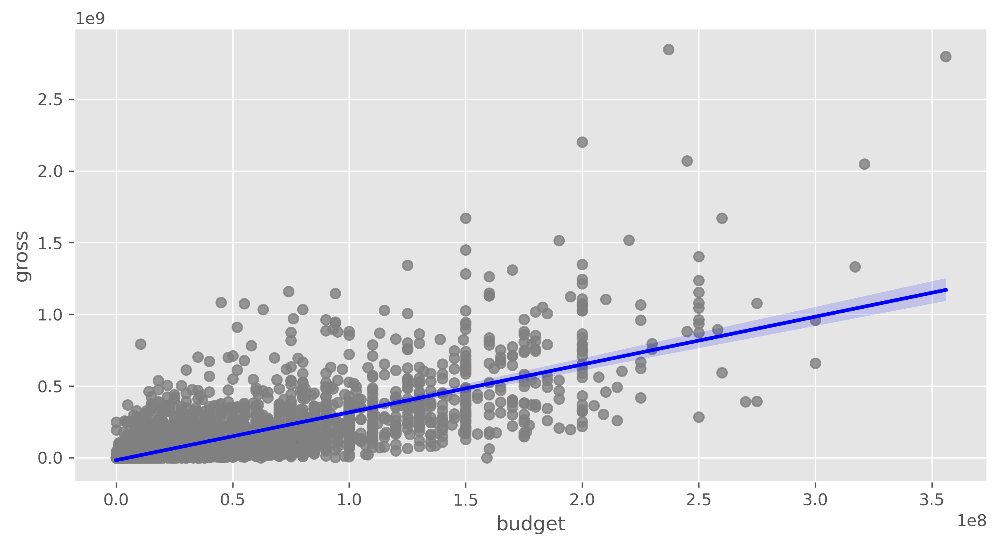
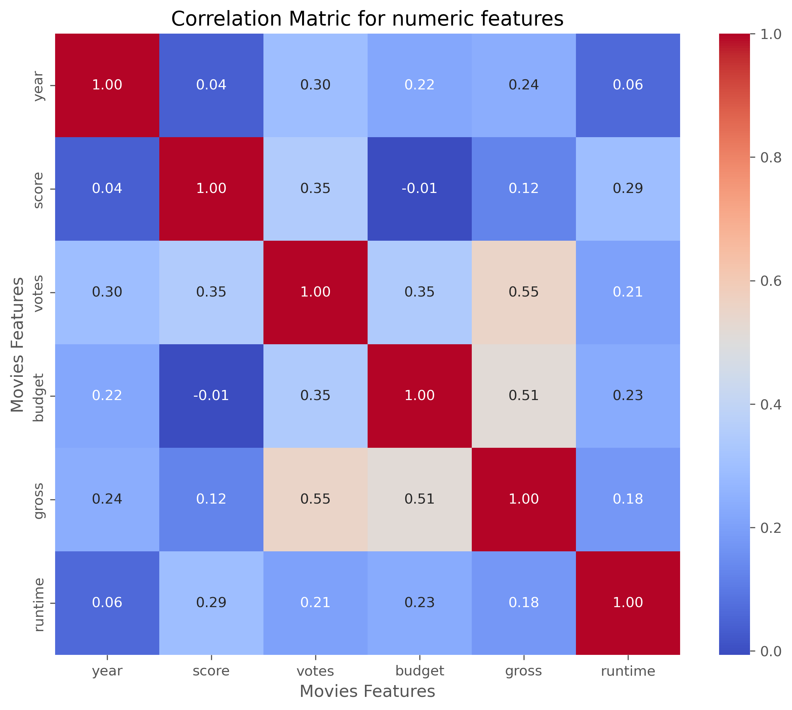
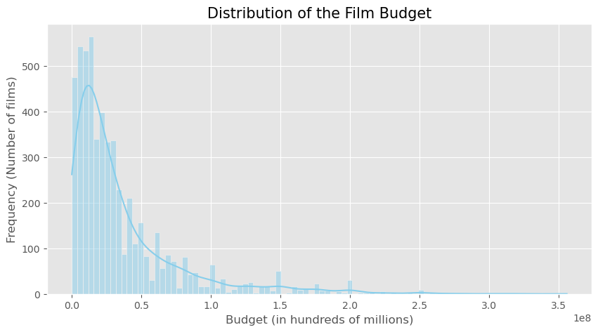

<h1 align="center"> 🎬 Movie Industry Analysis </h1>
 

  

 

## 📌 Project Description
This project analyzes a dataset from the film industry containing data on more than 7,000 movies between 1980 and 2020.
The main objective is to determine which factors (budget, company, director, genre, etc.) have the strongest correlation with a movie's financial success.
 

## 📊 Key Findings
1.  Budget has the highest correlation (0.74) compared to gross. Kendall's robust method ranks popularity (0.55) above investment (0.51),
suggesting that while money helps, the real return comes from generating hype and moving large audiences.
This suggests that financial investment in production and marketing is the most reliable predictor of commercial success.

3.  Popularity matters: The number of votes on review platforms has a very high correlation (0.61) with financial success, suggesting that hype is a vital predictor.

4. Contrary to popular belief, the production company has a very low correlation with financial success. The studio brand does not guarantee success.

 

<h3> Budget vs Gross</h3>

 
<h3> Correlation Matrix</h3>

 
<h3> top filming countries</h3>

 
<h3> Distribution of the films budget</h3>

 
🛠️ Technologies Used

*   **Python** (3.x)
*   **Pandas** (Data cleaning and manipulation)
*   **Seaborn / Matplotlib** (Data visualization)
*   **NumPy** (Statistical calculations)

 
✒️ Author
Victoria
